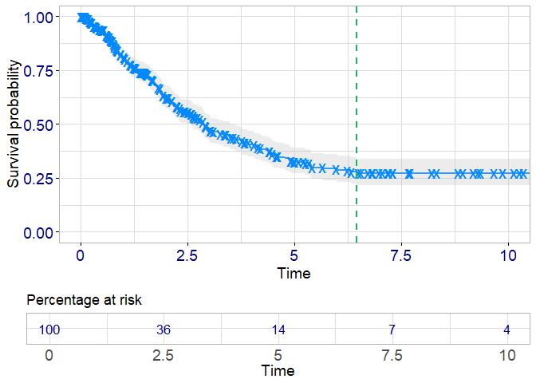
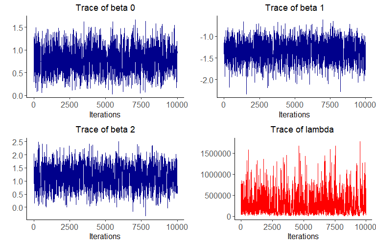

The mixcurelps package
================

<!-- Introduce badges -->


  

The `mixcurelps` package can be used to fit mixture cure survival models
with Laplacian-P-splines. It is based on the methodology presented in
[(Gressani, Faes, Hens, 2021)](https://arxiv.org/abs/2103.01526). The
population survival function is assumed to be a mixture of uncured and
cured subjects. As such, the model accounts for long-term survivors that
will never experience the event of interest, no matter how long the
period of follow-up. The proportion of uncured subjects (also called
*incidence*) is modeled with a logistic link function and the survival
function of the uncured (the *latency* part) is approached with a
flexible Cox proportional hazards model with a baseline hazard
approximated by penalized cubic B-splines [(Eilers and Marx,
1996)](https://doi.org/10.1214/ss/1038425655).

  

The approximate Bayesian inference methodology is governed by Laplace
approximations to the conditional posterior of latent variables. The
penalty parameter associated with P-splines is optimized and the maximum
*a posteriori* argument is considered. The prior of the roughness
penalty parameter is Gamma distributed with an additional (dispersion)
parameter for which a Gamma hyperprior is specified [(Jullion and
Lambert, 2007)](https://doi.org/10.1016/j.csda.2006.09.027). B-spline
matrices and the Laplace approximation subroutines are coded in C++ and
integrated in R via the [Rcpp package](http://www.rcpp.org/), so that
the code is highly efficient and computational times shrinked to
seconds. The Laplacian-P-splines mixture cure (LPSMC) methodology is
entirely sampling-free and outperforms classic MCMC approaches from a
computational perspective.

  

The package also includes a fully stochastic Bayesian inference approach
based on a Metropolis-Langevin-within-Gibbs (MLWG) algorithm to sample
from the joint posterior. The user is thus able to choose between a
fully sampling-free approach (via Laplace approximations) or a fully
stochastic approach (via MCMC) for inference in the mixture cure model.

  

The package can be used to generate survival data under two different
scenarios. The generating process is such that the Kaplan-Meier curve
exhibits a plateau. Thus, the datasets are suitable for mixture cure
model analysis. Once the model has been fitted with the `lpsmc()`
routine, the user can do a variety of things among which:

-   See pointwise estimates and (approximate) credible intervals of
    regression coefficients.
-   Compute the estimated cure proportion and associated credibility
    envelopes.
-   Plot the posterior of the (log) penalty parameter.
-   Plot baseline survival curves and survival curves of uncured
    subjects.

This version is unstable and there is still room to further improve the
routines.

## Getting ready

To dowload the package from Github, first install the
[devtools](https://cran.r-project.org/web/packages/devtools/index.html)
package and use the `install_github()` routine.

``` r
install.packages("devtools")
devtools::install_github("oswaldogressani/mixcurelps")
```

Then, load the package.

``` r
library("mixcurelps")
```

## A simulated example

First, a dataset is simulated with a sample of size 400 using the
`simdatmixcure()` routine and a plot of the associated Kaplan-Meier
curve is shown. A plateau is clearly visible in the tail (the start of
the plateau is indicated by a vertical dashed line), so that a mixture
cure model is appropriate for this type of data.

``` r
set.seed(2785)
simul <- simdatmixcure(n = 400, wshape = 1.45, wscale = 0.25, setting = 1)
simdat <- simul$simdata
plot(simul)
```



<br>

To fit a mixture cure model with Laplacian-P-splines, the `lpsmc()`
routine is used. The first argument is a formula taking the observed
follow-up times and the covariates in the incidence part `inci()` and
latency part `late()` into account. The scalar `K` is the number of
B-spline basis functions and the argument `stepsize` is an optional
parameter controlling the precision with which the maximum *a
posteriori* of the (log) penalty parameter is computed.

``` r
# Fit mixture cure model
formula <- Surv(tobs, event) ~ inci(x1 + x2) + late(z1 + z2)
fit <- lpsmc(formula, data = simdat , K = 12, stepsize = 0.1)
fit
```

    ## Fitting mixture cure model with Laplacian-P-splines 
    ## -------------------------------------------------- 
    ## Sample size:  400 
    ## No. of B-splines:  12 
    ## ------------------------------------------------------------------------------------------ 
    ##                                   (Incidence)                    
    ## ------------------------------------------------------------------------------------------ 
    ##             Estimate     sd CI90%.low CI90.up% CI95%.low CI95%.up
    ## (Intercept)    0.743  0.230     0.365    1.120     0.293    1.193
    ## x1            -1.298  0.211    -1.645   -0.952    -1.711   -0.886
    ## x2             1.109  0.358     0.521    1.697     0.408    1.810
    ## ------------------------------------------------------------------------------------------ 
    ##                                    (Latency)                     
    ## ------------------------------------------------------------------------------------------ 
    ##    Estimate     sd CI90%.low CI90.up% CI95%.low CI95%.up
    ## z1   -0.176  0.085    -0.317   -0.036    -0.343   -0.009
    ## z2    0.461  0.154     0.208    0.714     0.160    0.762
    ## ------------------------------------------------------------------------------------------ 
    ## 'Real' elapsed time: 0.63 seconds.

The table above shows the pointwise estimates, posterior standard
deviation and credible intervals for the regression parameters in the
incidence and latency parts of the model. For this particular simulated
setting, the coefficients of the incidence part are
*β*<sub>0</sub> = 0.70, *β*<sub>1</sub> =  − 1.15 and
*β*<sub>2</sub> = 0.95. For the latency part one has,
*γ*<sub>1</sub> =  − 0.10 and *γ*<sub>2</sub> = 0.25. Finally, the table
ends by showing the elapsed wall clock time required by the `lpsmc()`
routine in seconds. Let us now see how the (approximate) posterior of
the (log) penalty parameter looks like by using the `postpendist()`
routine:

``` r
postpendist(fit, low = 8, up = 15, themetype = "gray")
```


The maximum *a posteriori* for the log penalty parameter `v` can be
accessed by typing `fit$vhat` and is equal (in this example) to 12.35 as
indicated by the dashed black line above.

## Estimated cure proportion

Once `lpsmc()` has been called to fit a mixture cure model, the
`curefit()` routine can be used to computed the estimated proportion of
cured subjects for a given profile of covariates in the incidence part.
The code below randomly generates four covariates profiles (the rows in
the matrix `Xprof`) and computes the estimated cure rates `1-p(x)` for
each row:

``` r
Xprof <- matrix(c(rep(1,4), rnorm(4), rbinom(4, 1, prob = 0.5)), 
                nrow = 4 , byrow = FALSE)
fitcure <- curefit(fit, Xprof)
knitr::kable(fitcure$estimcure, digits = 3)
```

|            | (Intercept) |     x1 |  x2 | 1-p(x) | CI90.low | CI90.up | CI95.low | CI95.up |
|:-----------|------------:|-------:|----:|-------:|---------:|--------:|---------:|--------:|
| x.profile1 |           1 | -0.177 |   1 |  0.111 |    0.065 |   0.170 |    0.058 |   0.183 |
| x.profile2 |           1 | -0.912 |   1 |  0.046 |    0.022 |   0.084 |    0.018 |   0.093 |
| x.profile3 |           1 | -0.130 |   0 |  0.287 |    0.209 |   0.368 |    0.196 |   0.384 |
| x.profile4 |           1 |  0.309 |   0 |  0.415 |    0.327 |   0.502 |    0.310 |   0.518 |

The first three columns show the values of the generated covariate
profile. The fourth colum is the estimated cure proportion and the
remaining columns show the approximate credible envelopes. The true cure
rates for the chosen covariate profiles in `Xprof` are:

``` r
round(1 - fit$px(simul$betas, Xprof),3)
```

    ## [1] 0.135 0.063 0.299 0.415

## Baseline survival curve

The estimated baseline survival curve can be obtained with the
`survcurve()` routine. The `cred.int` argument can be used to fix the
credible level.

``` r
fitS0 <- survcurve(fit, cred.int = 0.95, outlisted = TRUE)
fitS0$S0plot
```


## Metropolis-Langevin-within-Gibbs

To fit the mixture cure model with the Metropolis-Langevin-within-Gibbs
sampler, the `LangevinGibbs()` routine is used. Here, we specify a chain
of length 15,000 and a warm-up period (burn-in) of 5,000. Of course, the
Metropolis-Langevin-within-Gibbs sampler is computationally more
demanding than the fully sampling-free Laplacian-P-splines approach.

``` r
fitMLWG <- LangevinGibbs(formula, data = simdat , K = 12, mcmcsample = 15000,
                         burnin = 5000)
fitMLWG
```

    ## Fitting mixture cure model with Langevin-Gibbs sampler 
    ## ------------------------------------------------------- 
    ## Sample size:  400 
    ## No. of B-splines:  12 
    ## ------------------------------------------------------------------------------------------ 
    ##                                   (Incidence)                    
    ## ------------------------------------------------------------------------------------------ 
    ##             Estimate     sd CI90%.low CI90.up% CI95%.low CI95%.up
    ## (Intercept)    0.777  0.230     0.412    1.155     0.336    1.248
    ## x1            -1.347  0.224    -1.727   -1.001    -1.834   -0.942
    ## x2             1.146  0.368     0.531    1.772     0.427    1.854
    ## ------------------------------------------------------------------------------------------ 
    ##                                    (Latency)                     
    ## ------------------------------------------------------------------------------------------ 
    ##    Estimate     sd CI90%.low CI90.up% CI95%.low CI95%.up
    ## z1   -0.177  0.086    -0.316   -0.034    -0.340   -0.004
    ## z2    0.463  0.157     0.202    0.717     0.133    0.766
    ## ------------------------------------------------------------------------------------------ 
    ## 'Real' elapsed time: 37.18 seconds
    ## MCMC chain length: 15000
    ## Burn-in length: 5000
    ## MCMC acceptance rate: 56.08%.

To get the traceplots of the regression coefficients of the incidence
part (and the roughness penalty parameter), type the following lines:

``` r
gridExtra::grid.arrange(plot(fitMLWG, param="beta0"),
                        plot(fitMLWG, param="beta1"),
                        plot(fitMLWG, param="beta2"), 
                        plot(fitMLWG, param="lambda",tracecol = "red"),
                        nrow = 2, ncol = 2)
```



  

To check that the generated chains have converged, we look at the Geweke
diagnostics of the latent variables (and the hyperparameters). Here in
total, we have 18 blue points (11 B-splines plus 5 regression
coefficients plus 2 hyperparameters). All of the Geweke z-scores are
within the ( − 1.96, 1.96) range (red dotted horizontal lines), which is
a good sign of convergence.

``` r
plot(fitMLWG$Geweke,type="p", pch=8, col="blue", ylim=c(-2.5,2.5),
     ylab="Geweke z-scores")
abline(h=c(-1.96,1.96),lty=2,col="red",lwd=2)
```


## Simulations

To assess the statistical performance of the methodology underlying the
algorithms, the `simlpsmc()` routine can be used to simulate datasets in
an iterative way and compute some metrics to assess how precise the
model fit is. The code below simulates `S=500` replications of samples
of size 300 and for each iteration fits a mixture cure model with
`lpsmc()`. A table with the desired metrics to check the performance
summarizes the simulations.

``` r
S <- 500
set.seed(14778)
sims <- simlpsmc(n = 300, scenario = 1, S = S, themetype = "classic")
```

    ## -------------------------------------------------- 
    ## Simulation results for LPSMC 
    ## -------------------------------------------------- 
    ## Scenario:  1 
    ## Sample size:  300 
    ## No. of B-splines:  15 
    ## No. of replications:  500 
    ## ------------------------------------------------------------------------------------------ 
    ##        Scenario Parameters   Mean   Bias    ESE   RMSE   CP90   CP95
    ## beta0     1.000      0.700  0.723  0.023  0.250  0.251 91.600 96.200
    ## beta1     1.000     -1.150 -1.184 -0.034  0.243  0.245 90.600 95.800
    ## beta2     1.000      0.950  0.972  0.022  0.397  0.397 90.200 96.600
    ## gamma1    1.000     -0.100 -0.100  0.000  0.098  0.098 88.200 93.400
    ## gamma2    1.000      0.250  0.224 -0.026  0.189  0.191 86.600 92.200
    ## ------------------------------------------------------------------------------------------ 
    ## Estimated coverage probabilities of S0 at selected quantiles 
    ## ----------------------------------------------------------------- 
    ##       t0.05 t0.1 t0.2 t0.3 t0.4 t0.5 t0.6 t0.7 t0.8 t0.9
    ## CP90%  75.4 84.4 86.4 86.6 85.8 90.2 91.6 91.2 76.4 32.8
    ## CP95%  82.2 89.2 94.4 93.0 93.8 96.2 96.6 95.6 85.2 46.4
    ## ------------------------------------------------------------------------------------------ 
    ## Estimated coverage probabilities of S(uncured) for z=(0,0.4) 
    ## ----------------------------------------------------------------- 
    ##       t0.05 t0.1 t0.2 t0.3 t0.4 t0.5 t0.6 t0.7 t0.8 t0.9
    ## CP90%  78.8 88.2 89.0 87.8 87.0 91.0 93.2 89.6 72.0 18.6
    ## CP95%  87.6 93.0 93.6 94.0 94.8 97.0 97.6 93.6 82.0 27.4
    ## ------------------------------------------------------------------------------------------ 
    ## Total elapsed time: 208.64 seconds.

The above table shows the simulation results associated with the
regression coefficients (table on top) and also the estimated (90% and
95%) coverage probabilities of the baseline survival curve and the
survival curve of the uncured respectively at selected quantiles.
Dividing the total elapsed time by the number of replications allows to
assess the average time required by the `lpsmc()` routine to fit the
model (here 0.417 seconds). To show the simulation results associated
with the regression coefficients in a clean table:

``` r
knitr::kable(sims$simulres, digits = 3)
```

|        | Scenario | Parameters |   Mean |   Bias |   ESE |  RMSE | CP90 | CP95 |
|:-------|---------:|-----------:|-------:|-------:|------:|------:|-----:|-----:|
| beta0  |        1 |       0.70 |  0.723 |  0.023 | 0.250 | 0.251 | 91.6 | 96.2 |
| beta1  |        1 |      -1.15 | -1.184 | -0.034 | 0.243 | 0.245 | 90.6 | 95.8 |
| beta2  |        1 |       0.95 |  0.972 |  0.022 | 0.397 | 0.397 | 90.2 | 96.6 |
| gamma1 |        1 |      -0.10 | -0.100 |  0.000 | 0.098 | 0.098 | 88.2 | 93.4 |
| gamma2 |        1 |       0.25 |  0.224 | -0.026 | 0.189 | 0.191 | 86.6 | 92.2 |

The beta parameters are the coefficients of the incidence part and the
gamma parameters the coefficients in the latency part. The estimated
baseline survival curves and a boxplot of the Average Squared Error
associated to the incidence across various covariate profiles can be
obtained as follows:

``` r
gridExtra::grid.arrange(sims$S0plot, sims$ASEplot, nrow = 1)
```


## Package version

This is version 1.1.1 (2021-10-06) – “MCMC kicks in”.

## License

Copyright © 2021 Oswaldo Gressani. All rights reserved.

## References

Gressani, O., Faes, C. and Hens, N. (2021). Laplacian P-splines for
Bayesian inference in the mixture cure model. ArXiv preprint.
arxiv.org/abs/2103.01526

Eilers, P.H.C. and Marx, B.D. (1996). Flexible smoothing with B-splines
and penalties. *Statistical Science*, 11(2), 89-121.
<https://doi.org/10.1214/ss/1038425655>

Jullion, A., and Lambert, P. (2007). Robust specification of the
roughness penalty prior distribution in spatially adaptive Bayesian
P-splines models. *Computational Statistics & Data Analysis*, 51(5),
2542-2558. <https://doi.org/10.1016/j.csda.2006.09.027>

## Acknowledgments

This project is funded by the European Union’s Research and Innovation
Action under the H2020 work programme, EpiPose (grant number 101003688).
